project name: MU Library

group information (student name and SID)：

CHAN Chi Kit 12782371 LAM KA PANG 12697373

operation guides of your server:

Login by username and password

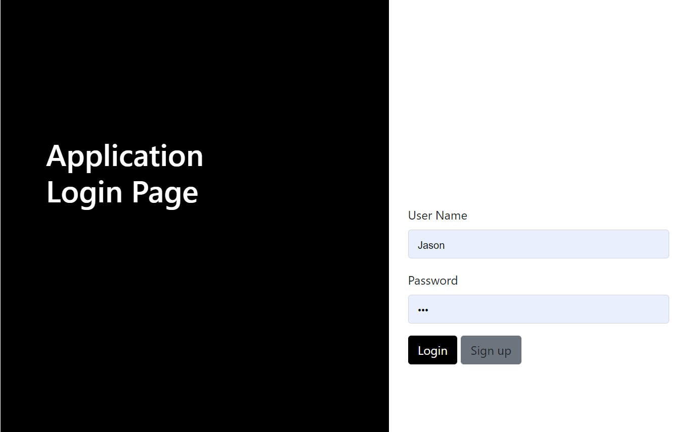

if input wrong username or password will show warning message

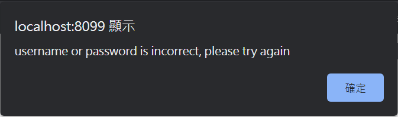

Sign up username and password

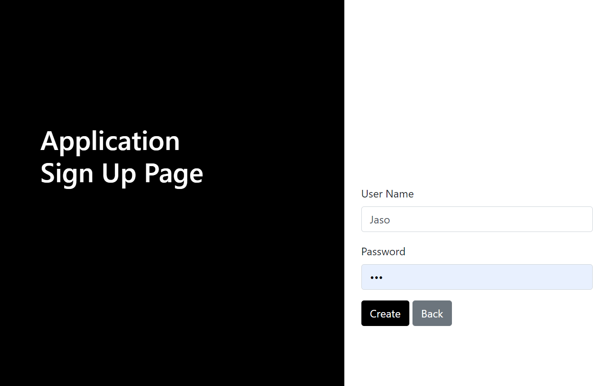

logout

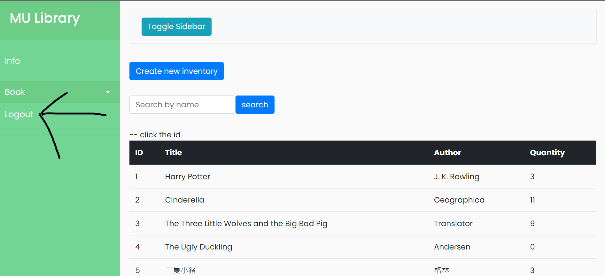

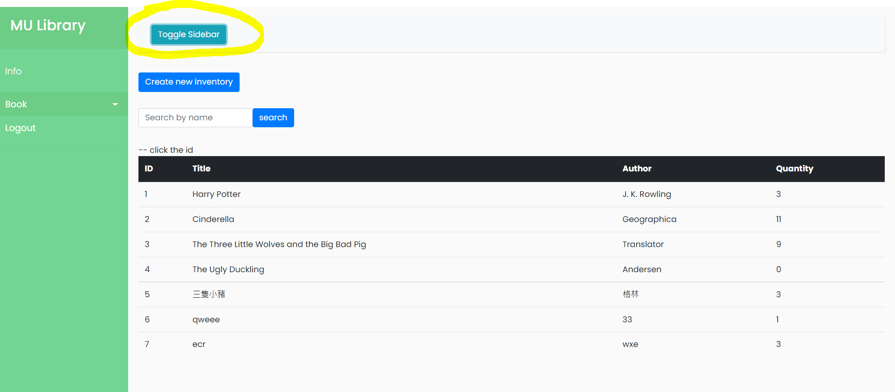

click to hide the sidebar

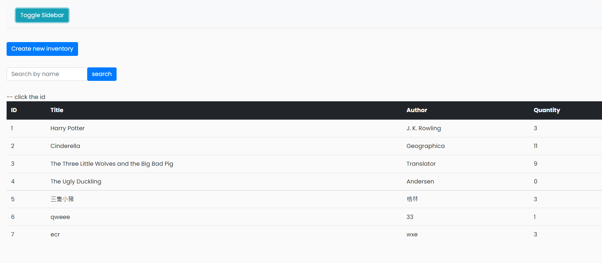

Search function

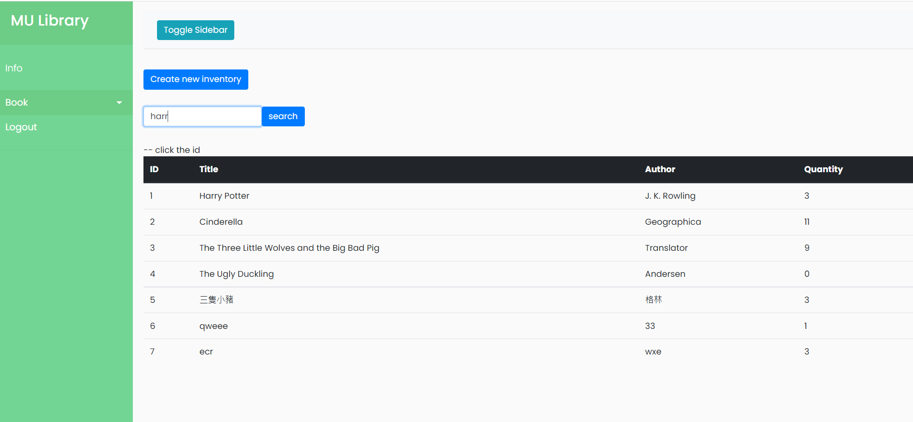

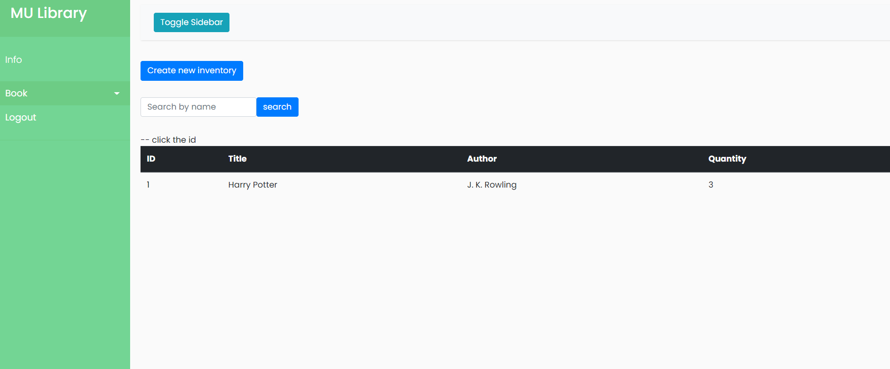

create page \* means not empty

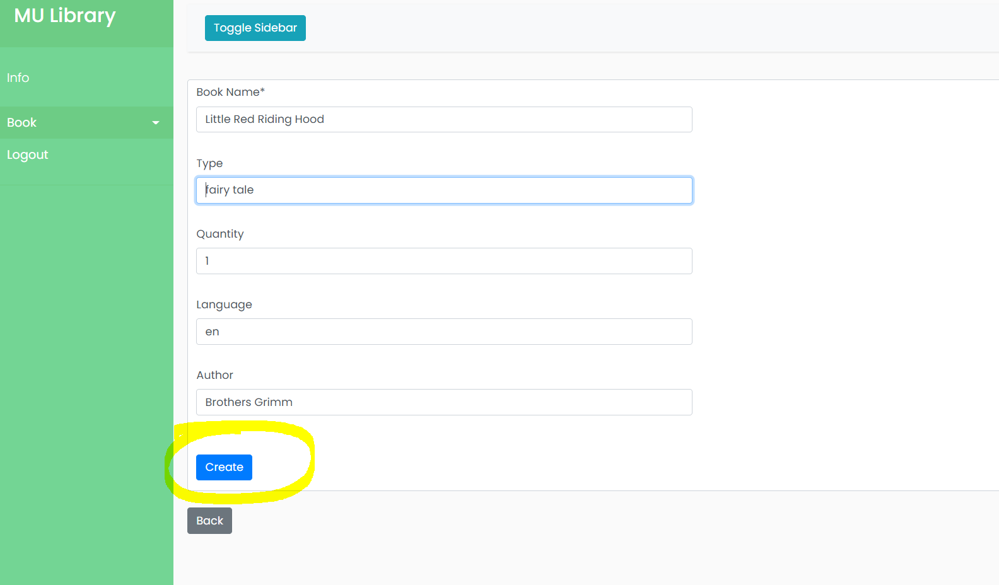

click id

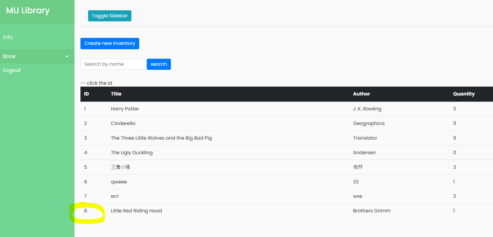

The creator will automatically be an manager of this book

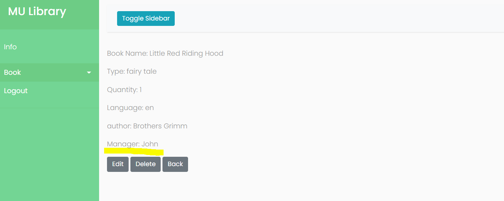

only manager can delete and edit the book

when i click edit button

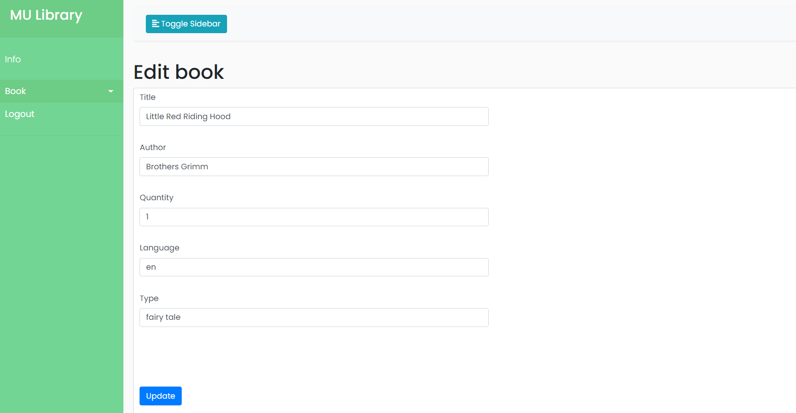

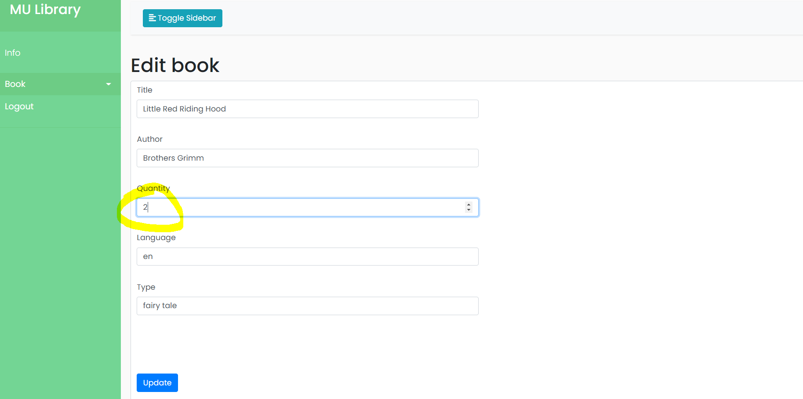

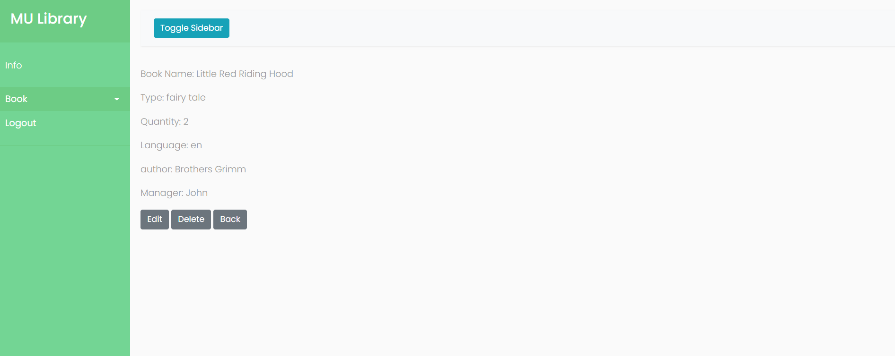

click delete button

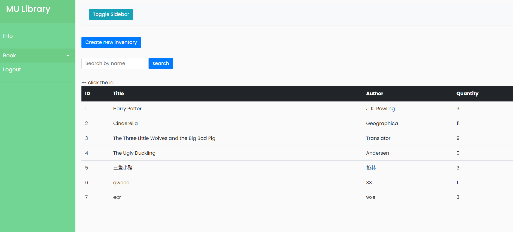

if user(John) click delete or edit

